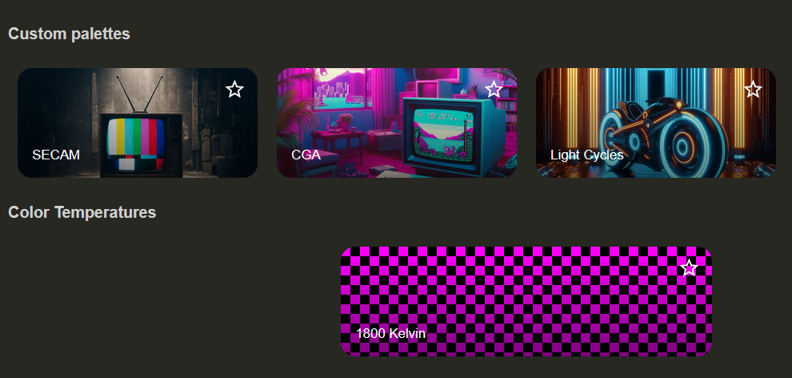

# Custom presets

Starting with v1.1.0, this integration also allows you to have your own custom presets.

Be advised though that this feature will not hold your hand. It is intended to be used by developers.

## How

On startup, the custom_component will create folder named `userdata/custom` inside `custom_components/scene_presets`
of your home assistant instance. By default, this folder will be empty apart from another folder named `assets`.

To add custom presets, you create a `presets.json` in that folder and add your custom images to that `assets` folder.
This essentially mirrors the structure of the included scenes. The JSON Schema is the same.
Everything in the custom presets will simply be added at the end of the lists of categories and presets.

Please note that there is no validation in place that would prevent you from creating ID conflicts nor is there any
validation ensuring that the schema of the custom data is correct. Just don't provide any incorrect data.

If I understood the HACS documentation correctly, this folder should survive component updates.<br/>
For now though, I'd recommend making backups just to be sure.

## Example

The best way to explain this feature is to give an example.

First the directory structure:

```
user@foo:/homeassistant/custom_components/scene_presets# tree userdata/
userdata/
└── custom
    ├── assets
    │ └── 1d2ef59e-8f29-4d58-a437-c0b03d90ce8a.jpeg
    └── presets.json

3 directories, 2 files
```

And here's the content of the `presets.json`:

```
{
  "categories": [
    {
      "name": "Color Temperatures",
      "id": "e0c17262-f84b-4943-bdd5-fcd24c574f24"
    }
  ],
  "presets": [
    {
      "id": "1d2ef59e-8f29-4d58-a437-c0b03d90ce8a",
      "categoryId": "e0c17262-f84b-4943-bdd5-fcd24c574f24",
      "name": "1800 Kelvin",
      "bri": 76,
      "lights": [
        {
          "x": 0.6264,
          "y": 0.3632
        }
      ]
    }
  ]
}
```

In there you can see a few things:

- We've added a new category named "Color Temperatures"
- We've added a single preset with the "Color Temperatures" categoryId 

  => every preset needs to be part of a category <br/>
  => custom presets can be part of stock categories <br/>
- The new "1800 Kelvin" preset has a single light

  => There is no limit to how many lights a preset can have <br/>
  => If you apply a preset to a group with more lights, some options will be repeated <br/>
  => Colors have to be specified as X/Y

After adding that example JSON and restarting Home Assistant, it looks like this:



And as you can see, we forgot to install Counter-Strike: Source.

To fix that, we need to change the preset to include an `img` key like this:

```
    {
      "id": "1d2ef59e-8f29-4d58-a437-c0b03d90ce8a",
      "categoryId": "e0c17262-f84b-4943-bdd5-fcd24c574f24",
      "name": "1800 Kelvin",
      "img": "1d2ef59e-8f29-4d58-a437-c0b03d90ce8a.jpeg"
      "bri": 76,
      "lights": [
        {
          "x": 0.6264,
          "y": 0.3632
        }
      ]
    }
```

This will now point to `userdata/custom/assets/1d2ef59e-8f29-4d58-a437-c0b03d90ce8a.jpeg`.<br/>
Make sure to place the desired image there.

And that's it. When in doubt, take a look at the `presets.json` and `assets` included with the component.<br/>
As said, they are the same format and structure.

## Misc

To convert RGB colors to X/Y, you can use this js snippet using the `cie-rgb-color-converter` npm library:
```
const colorConverter = require("cie-rgb-color-converter");

const xyValue = colorConverter.rgbToXy(255, 126, 0);
xyValue.x = parseFloat(xyValue.x.toFixed(4));
xyValue.y = parseFloat(xyValue.y.toFixed(4));

console.log(JSON.stringify(xyValue, null, 2))
```